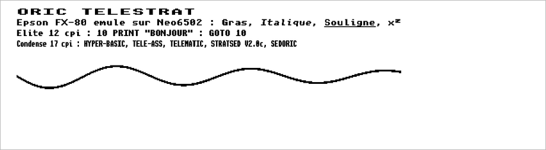
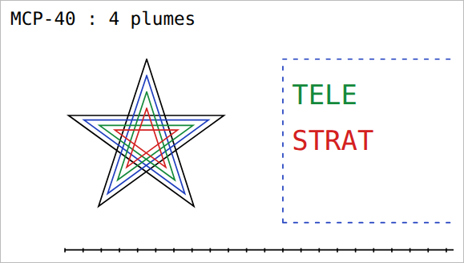
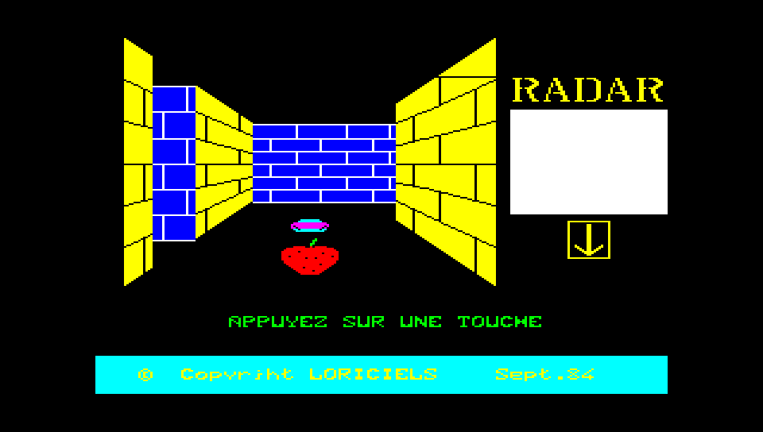
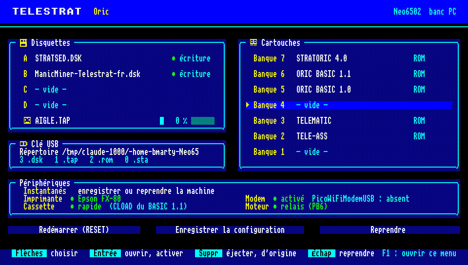
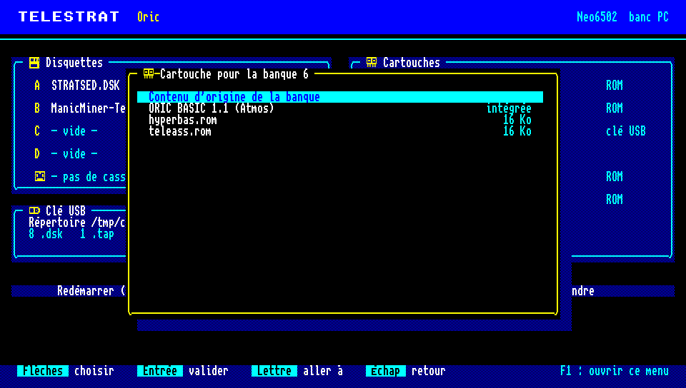
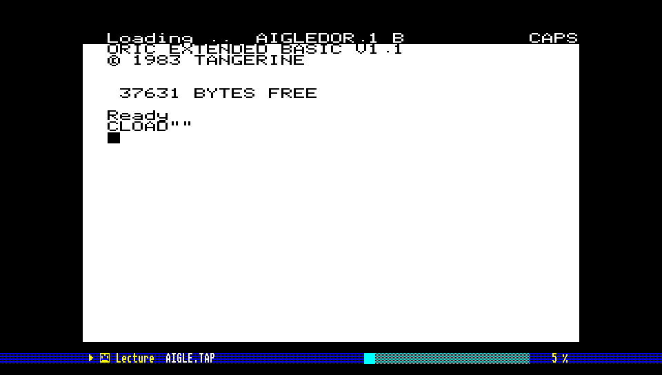

# Neo6502TeleStrat — Oric Telestrat pour Olimex Neo6502

> ⚠️ Avertissement : ce programme est un programme généré par Claude Code sous la supervision d'un être humain : il a été utilisé pour améliorer, développer, rendre compatible ou traduire ce logiciel.

Portage de l'**Oric Telestrat** (1986) sur l'**Olimex Neo6502**, sur le modèle
de `oric.uf2` de [reload-emulator](https://github.com/benedictemarty/reload-emulator) :
le **vrai W65C02S** du Neo6502 exécute TELEMON, le **RP2040** sert la mémoire
(8 banques de 16 Ko en `$C000-$FFFF`) et émule les périphériques (VIA 1 et 2,
AY-3-8912, Microdisc intégré, ACIA 6551, vidéo ULA en DVI). Livré en
`telestrat.uf2`, compatible avec le multi-boot du firmware Neo6502.

**Version : 0.4.1 — validé sur carte.** Sur une vraie Olimex Neo6502 (recette
par sonde SWD, `tools/carte.py`) : TELEMON 2.4, STRATSED, HYPER-BASIC et le menu
démarrent ; `PRINT 6*7` et `DIR` fonctionnent ; le 65C02 tourne à **1,000 MHz**,
cœur 0 chargé à 45-62 % (76 % au pire pendant un DIR), cœur 1 à 35 µs par
ligne, aucune ligne DVI en retard. Affichage 960x544 à 372 MHz.

**Sprint 4 (0.4.0).** Le cœur 0 du RP2040 tient le 65C02 à 1 MHz (59-68 % de
charge mesurée sans carte, contre 150 % avant), sans aucun changement de
comportement, prouvé par rejeu exact contre un modèle de référence
(docs/PERFORMANCE.md).

**Sprint 3 (0.3.x).** Le Telestrat démarre sur disquette (TELEMON 2.4,
STRATSED V2.0c, HYPER-BASIC V2.0b, TELE-ASS, TELEMATIC V2.0b) ; HYPER-BASIC
calcule, liste le disque, sauvegarde et recharge, imprime. **TELEMATIC fonctionne
en serveur Minitel** : un correspondant qui appelle fait sonner la ligne,
TELEMATIC décroche, envoie les pages Videotex du serveur DEMO et répond aux
touches (ENVOI, choix, SOMMAIRE) ; sur le Neo6502 la ligne est un modem Wi-Fi
**PicoWiFiModemUSB**. Firmware **compilé, non encore essayé sur carte**.

## Construire

Prérequis : `~/reload-emulator` avec ses sous-modules (`pico-sdk`, `PicoDVI`,
`tinyusb`), `gcc`, `python3`, `cmake` et `arm-none-eabi-gcc` pour le firmware.
Le projet compile contre une **étiquette vérifiée** de reload (le « socle »,
`RELOAD_SOCLE`, aujourd'hui `socle-2026-09-30`), pas contre sa tête :
`make` en fait un clone local dans `~/.cache/reload-socle/` au premier appel
(`tools/reload_socle.sh`, sans réseau, `~/reload-emulator` n'est pas modifié).

```sh
tools/fetch_roms.py     # ROM -> src/roms/telestrat_roms.h (non versionné)
make                    # banc PC + tests
make uf2                # build/rp2040/telestrat.uf2
cmake -S platforms/rp2040 -B build/rp2040-ram64k -DTELESTRAT_RAM64K=ON && make -C build/rp2040-ram64k telestrat
```

`RELOAD_SOCLE=socle-…` change d'étiquette ; `RELOAD_DIR=...` vise un autre
arbre de reload (par exemple `~/reload-emulator` pour essayer sa tête). Pour un slot
multi-boot : `make uf2 NEO_MULTIBOOT_DIR=~/Neo6502firmware/multiboot NEO_SLOT_TELESTRAT=3`.

## ROM

Les ROM ne sont pas versionnées. `tools/fetch_roms.py` les prend dans les
clones locaux ou les télécharge, et vérifie leur MD5 :

| Banque | ROM | Source | MD5 |
|---|---|---|---|
| 7 | TELEMON 2.4 | [jedeoric/telemon](https://github.com/jedeoric/telemon/tree/master/original) | `9a432244…4e05` |
| 6 | HYPER-BASIC 2.0b | [assinie/Hyper-Basic](https://github.com/assinie/Hyper-Basic) | `364bf095…8cddfc` |
| 2 | TELE-ASS | [jedeoric/tele-ass](https://github.com/jedeoric/tele-ass) | `2324c9cc…2990` |
| 3 | TELEMATIC 2.0b (8 Ko en `$E000`) | [assinie/Telematic](https://github.com/assinie/Telematic) | `0a814078…2e4e` |

STRATSED (le DOS, chargé en banque 0) vient de la disquette système : aucun
binaire à fournir. Source commentée : [assinie/STRATSED](https://github.com/assinie/STRATSED).

Carte des banques : notice « Extension RAM 64 Ko pour Oric Telestrat »
(F. Broche, 1987), voir [docs/ARCHITECTURE.md](docs/ARCHITECTURE.md).

## Construction

`git submodule update --init` (TinyUSB 0.21.0 dans `third_party/tinyusb`),
puis `make` (banc et tests) et `make uf2` (firmware).

## Recette sur carte par sonde SWD

Avec une sonde Debugprobe (CMSIS-DAP) sur le connecteur SWD du Neo6502 et
l'OpenOCD qui connaît la flash Puya (`~/.local/openocd-dev`, voir la session
BBC) :

```sh
cmake -S platforms/rp2040 -B build/rp2040 -DTELESTRAT_FLASH_DISK=$HOME/oriclib/games/dsk/STRATSED.DSK
make -C build/rp2040 telestrat
tools/carte.py flasher              # programme et redémarre (attendre ~25 s)
tools/carte.py ecran capture.png    # écran texte, et image 240x224
tools/carte.py taper '1'            # clavier du Telestrat (file de touches)
tools/carte.py taper 'PRINT 6*7\n'
tools/carte.py mesure               # MHz réels, µs par trame et par ligne, retards DVI
tools/carte.py deposer STRATSED.DSK TELESTRA.CFG   # fichiers copiés sur la clé de la carte
tools/carte.py cle retiree          # état de la clé et des lecteurs ; attend le retrait (ou : montee)
tools/carte.py relire IMPR0001.PNG page.png        # fichier de la clé relu
tools/carte.py menu                 # ouvre ou ferme le menu ; menu ouvert, « taper » le pilote
```

Mode d'emploi de la sonde et pièges vus sur la carte (partagé avec les autres
projets Neo6502) : `docs/SONDE_SWD.md`.

```
tools/carte.py ligne appel          # ligne de recette SWD à la place du modem : un correspondant appelle
tools/carte.py ligne lire 500       # ce que le Telestrat lui envoie
tools/carte.py ligne envoyer '1\E'  # ses touches (\E = ENVOI) ; ligne raccrocher, ligne etat
```

`-DTELESTRAT_FLASH_DISK=image.dsk` intègre une disquette en flash (lecture
seule), insérée dans le lecteur A tant qu'aucune clé ne fournit de `.dsk`.
`-DTELESTRAT_VIDEO_480=ON` : 800x480 à 295,2 MHz au lieu de 960x544 à 372 MHz.

## Utilisation (Neo6502)

**Clé USB** : stockage de masse (FAT12/16/32 ou exFAT, noms longs), lu par
le RP2040 ; le Telestrat ne la voit pas directement mais par ce qu'on y prend
à la racine :

- images `.dsk` (format `MFM_DISK`, comme pour Oricutron) : disquettes des
  lecteurs A à D, lues et réécrites piste par piste (`SAVE`… modifie le
  fichier) ; au montage, la première va dans A ;
- images `.rom` de 16 Ko (ou 8, 4, 2, 1 Ko, répétées) : cartouches, copiées en
  RAM à la place de la ROM de la banque (TELE-ASS, TELEMATIC, HYPER-BASIC,
  TELEMON) ; une seule de plus dans une banque vide (aucune avec la variante
  RAM 64 Ko) ;
- cassettes `.tap` : lues par le lecteur de cassette émulé (prise DIN du
  Telestrat, comme l'Atmos : signal sur CB1 du VIA 1, moteur sur PB6), en
  temps réel.

**Menu (F1)** : disquettes des lecteurs A à D, cassette (position, moteur),
cartouches des banques 7 à 1 (ROM intégrée, `.rom` de la clé ou contenu
d'origine), périphériques (imprimante et modem : activés ou coupés par
Entrée, état du modem), Redémarrer (à froid, pour que TELEMON inventorie les
cartouches), Enregistrer la configuration dans `TELESTRA.CFG`, Reprendre.
L'émulation est en pause tant qu'il est ouvert. Flèches, Entrée, Suppr
(éjecter / contenu d'origine), une lettre (aller au fichier), Échap.

**Démarrage** : `demarrage=choix` dans `TELESTRA.CFG` ouvre, dès le montage
de la clé, la page « Démarrer sur… » : configuration de la clé, Telestrat
(TELEMON 2.4, HYPER-BASIC, TELE-ASS, TELEMATIC), STRATORIC (mode Atmos,
disquettes SEDORIC), ORIC BASIC 1.1 (mode Atmos simple, cassettes), puis
les profils de la clé. `demarrage=telestrat|stratoric|atmos` applique
directement un profil intégré, `demarrage=Libellé` un profil de la clé.

**Profils de la clé** : chacun choisit ses ROM, sur sa clé, sans rien
embarquer dans le firmware. Jusqu'à trois lignes `profil=` dans
`TELESTRA.CFG` : un libellé, puis les banques (`.rom` de la clé ou ROM
intégrée `@…` ; les banques non citées gardent leur contenu d'origine) :

```
profil=ORIX 1.0;bank7=orixbank7.rom;bank6=orixbank6.rom;bank5=orixbank5.rom
profil=Mes jeux;bank7=@stratoric;bank4=jeu.rom
demarrage=choix
```

(ORIX, par exemple, démarre ainsi jusqu'à son shell ; ses fichiers demandent
un CH376 qui n'est pas émulé.)

**Instantanés** : « Instantanés » dans le menu (Entrée) enregistre la
machine entière dans `ETAT0001.STA`, `ETAT0002.STA`… à la racine de la clé
(processeur, RAM, banques de RAM, puces, contrôleur de disquettes, cadence),
ou la reprend depuis un `.sta` de la clé : la machine revient à l'instant
enregistré, cartouches comprises (remises si besoin). Les disquettes et la
cassette ne font pas partie de l'instantané : ce sont celles qui sont
insérées (comme on garde les disquettes à côté de la machine). Refusé pendant
un accès disque. Un instantané se relit sur la même plate-forme et la même
variante (carte standard, carte RAM 64 Ko, banc PC). **Essayé sur carte
(v0.16.1)** : le 65C02 du Neo6502 étant une vraie puce, ses registres
sont lus et remis par un NMI détourné (voir ARCHITECTURE) : instantané pris
et repris en plein jeu sur la carte.

**Imprimante** : trois modèles, choisis dans le menu (Entrée sur
« Imprimante » : Texte → Epson FX-80 → Traceur MCP-40 → coupée) ou par
`imprimante_type=` :

- **Texte** : ce que le Telestrat imprime (`LPRINT`…) est ajouté tel quel à
  `IMPRIM.TXT` à la racine de la clé (réglable par `imprimante=`) ;
- **Epson FX-80** (matricielle, Centronics, codes ESC/P) : chaque page
  (8,5 x 11 pouces, 144 points par pouce) devient `IMPR0001.PNG`,
  `IMPR0002.PNG`… : Pica, Élite, condensé, élargi, gras, double frappe,
  italique, souligné, exposant/indice, interlignes, marges, tabulations,
  graphiques (`ESC K L Y Z * ^`) ;
- **Traceur MCP-40** (table traçante 4 couleurs de l'Oric) : chaque tracé
  devient `IMPR0003.SVG`… : mode texte (40 colonnes), mode graphique
  (`CHR$(18)`) : traits absolus et relatifs `D` `J`, déplacements `M` `R`,
  origine `I` `H`, plumes `C0`-`C3` (noir, bleu, vert, rouge), pointillés
  `L`, texte `P` de taille `S` et de sens `Q`, axes gradués `X`, retour au
  texte `A`.

Les pages et les tracés sont écrits sur la clé au fil de l'eau (seule une
bande de 28 lignes est en mémoire) ; un fichier est terminé au saut de page
(`CHR$(12)`, FX-80), à l'ouverture du menu, ou après 10 secondes sans
impression. Quand la clé écrit, le Telestrat attend (l'ACK de l'imprimante
est retardé) : rien n'est perdu. Variante RAM 64 Ko : Texte seulement.
**Essayé sur carte** : page de la FX-80 (v0.16.0) et tracé de la MCP-40
(v0.16.4) écrits sur la clé.

| Epson FX-80 (PNG) | MCP-40 (SVG) |
|---|---|
|  |  |

Limites connues : police unscii-8 (8 x 8) à la place de celle de la FX-80,
mode proportionnel imprimé en Pica, caractères définis par l'utilisateur
ignorés, jeux internationaux États-Unis et France seulement. MCP-40
(mécanisme du Tandy CGP-115, dont le manuel complète ceux de l'Oric) :
couleurs 0 noir, 1 bleu, 2 vert, 3 rouge (manuel CGP-115 ; les manuels Oric
se contredisent) ; interligne du mode texte et hauteur des caractères
mesurés sur l'autotest imprimé du manuel CGP-115 ; dessin des pointillés et
longueur des graduations estimés ; caractères en police « monospace », pas
celle de la machine.

**Clé retirée puis rebranchée** : au retrait, les lecteurs de la clé sont
vidés (l'image en flash revient dans A), la cassette est éjectée ; au
rebranchement, la clé est relue et les disquettes de `TELESTRA.CFG` remises,
sans redémarrer (les cartouches déjà chargées restent). Une piste modifiée
mais pas encore réécrite au moment du retrait est perdue. **Non essayé sur
carte.**

**Cartouche STRATORIC (mode Atmos, disquettes SEDORIC)** : intégrée au
firmware, comme la décrit le manuel du développeur Telestrat (banque 7 SEDORIC
+ démarrage, 6 ORIC BASIC V1.1, 5 ORIC BASIC V1.0). Menu : banque 7 →
« STRATORIC 4.0 » (charge les trois banques), Redémarrer : « STRATORIC V4.0 ».
Les disquettes SEDORIC des jeux Oric/Atmos démarrent (« 3D Munch » de
Loriciels au banc), et les cassettes se lisent. `TELESTRA.CFG` :
`bank7=@stratoric`. Il faut l'emplacement supplémentaire : pas avec la
variante RAM 64 Ko.



**Mode Atmos simple et cassettes** : banque 7 → « ORIC BASIC 1.1 (Atmos) »,
Cassette → un `.tap`, Redémarrer ; puis `CLOAD""` (et `RUN`). `CSAVE"NOM"` enregistre
`NOM.TAP` à la racine de la clé. Pendant la lecture ou l'écriture, un bandeau
sous l'image montre la cassette et sa position. TELEMON et
HYPER-BASIC n'ont pas de chargeur de cassette : le mode Atmos est le moyen de
lire les cassettes sur Telestrat.

Deux réglages de la cassette, dans le panneau « Périphériques » du menu
(Entrée) ou dans `TELESTRA.CFG` :

- **Cassette rapide** (`cassette_rapide=oui`) : `CLOAD` du BASIC 1.1 est
  immédiat. Les deux routines de lecture de la ROM (lire un octet, chercher la
  synchro) sont remplacées, dans sa copie en mémoire, par la lecture directe
  de la bande ; la ROM d'origine revient quand on coupe l'option. « L'Aigle
  d'Or » (deux parties) arrive à son écran d'accueil au lieu de rester
  plusieurs minutes sur « Loading ». Les jeux qui ont leur propre chargeur
  (lecture directe du signal) gardent la vitesse réelle, comme le BASIC 1.0.
- **Moteur toujours en marche** (`cassette_moteur=toujours`, défaut
  `relais`) : pour un câble DIN sans relais moteur, la bande défile dès
  qu'elle est insérée, sans attendre que l'Oric allume le moteur (PB6). Comme
  avec un vrai magnétophone, taper `CLOAD""` avant d'insérer la cassette.

**Pas encore essayé sur carte** (aperçus du banc PC) :





**Télématique** : brancher un PicoWiFiModemUSB (modem Hayes USB, Wi-Fi) sur le
port USB hôte — avec un concentrateur s'il faut aussi le clavier et la clé. Un
fichier `TELESTRA.CFG` facultatif à la racine de la clé règle la ligne :

```
listen=3615            # port TCP où le modem attend les appels (AT$SP) : serveur TELEMATIC
dial=hôte:port         # composé par ATD quand le Minitel émulé se connecte
rs232=usb              # prise RS232 : modem USB (défaut) ou uext
a=STRATSED.DSK         # lecteurs A à D (a= … d=), écrits par le menu
bank5=jeu.rom          # cartouches de la clé (bank1= … bank7=), écrites par le menu
bank7=@stratoric       # ROM intégrée : STRATORIC (banques 7, 6, 5) ; @atmos : BASIC 1.1 seul
imprimante=IMPRIM.TXT  # imprimante Texte : sortie ajoutée à ce fichier (vide : pas d'impression)
impression=oui         # imprimante activée (non : coupée) ; écrit par le menu
imprimante_type=fx80   # texte, fx80 (pages PNG) ou mcp40 (tracés SVG) ; écrit par le menu
modem=oui              # modem activé (non : ligne coupée) ; écrit par le menu
cassette_rapide=oui    # CLOAD du BASIC 1.1 immédiat (non : vitesse réelle) ; écrit par le menu
cassette_moteur=relais # toujours : bande défilant sans relais moteur ; écrit par le menu
demarrage=choix        # page « Démarrer sur… » au montage de la clé ; ou telestrat, stratoric, atmos, Libellé
profil=Libellé;bank7=a.rom;bank6=@atmos   # profil de la clé (trois au plus), proposé au démarrage
```

Serveur : en HYPER-BASIC, `APLIC 4`, « Accès disque », `N` + nom + CTRL+L pour
charger l'arborescence (`DEMO` sur la disquette STRATSED), ESC, « 2 Lancer le
serveur » : « Attente de communication ». Un client Minitel TCP (émulateur ou
passerelle) qui se connecte au port du modem est alors servi.

**Prise RS232** : par défaut vers le même PicoWiFiModemUSB, qui suit la prise
choisie par le Telestrat (PA4). Sur la prise RS232, le modem reçoit les octets
tels quels : le logiciel du Telestrat lui parle Hayes lui-même (`ATDT
hôte:port`, `+++`, `ATH`…), comme à un modem RS232. Revenir à la prise
Minitel réinitialise le modem pour TELEMATIC : raccrocher avant. En
HYPER-BASIC : `SOUT n`, `SSAVE "NOM",A#début,E#fin`, `SLOAD`, `CONSOLE`
(terminal). Avec `rs232=uext`, la prise va à l'UART0 du connecteur UEXT : TX
en UEXT 3 (GPIO 28), RX en UEXT 4 (GPIO 29), 3,3 V, au format programmé dans
l'ACIA (9600 bauds 8N1 avec TELEMON) ; les messages du firmware, qui sortent
sinon sur cet UART, n'y passent plus. **Pas encore essayé sur carte.**

| Touche | Effet |
|---|---|
| F1 | menu : disquettes, cassette, cartouches, RESET, configuration |
| F12 | RESET |
| F2 | instantané enregistré (ETATnnnn.STA sur la clé), résultat dans le menu |
| F3 | reprend le dernier instantané (enregistré ou repris, sinon le plus grand numéro) |
| F11 | NMI |
| Windows gauche | FUNCT |
| Pause | retour au firmware Neo6502 (multi-boot) |
| Manette USB | joystick droit (la 2ᵉ manette : joystick gauche) |
| Volume + / Volume − (clavier multimédia) | volume du son, 8 pas (environ 3 dB chacun), jauge affichée 2 s |
| Muet (clavier multimédia) | coupe ou rétablit le son (Volume + ou − le rétablit aussi) |

Les touches multimédia sont lues sur l'interface HID qui les décrit (page
« Consumer »). Le niveau (pas la coupure) est écrit dans `TELESTRA.CFG`
(`volume=0` … `volume=8`, même clé que `ORIC.CFG` de reload) quand le menu
enregistre la configuration, et relu au démarrage ; sans cette ligne, volume
au maximum. **Pas encore essayé sur carte.**

## Banc PC sans écran

```sh
build/telestrat_headless -c standard -f 300 -s -b     # écran texte + état des banques
build/telestrat_headless -c ram64k -p boot.ppm        # image 240x224
build/telestrat_headless -c oricutron -0 STRATSED.DSK -f 1200 -w 500 -t '1~~~~~~DIR\n' -s
build/telestrat_headless -0 a.dsk -W a2.dsk -P imprimante.txt ...   # disque réécrit, imprimante
build/telestrat_headless -0 a.dsk -G fx80:pages ...                  # pages PNG de la FX-80 dans pages/
build/printer_render mcp40 IMPRIM.TXT traces                         # rendu après coup d'une impression brute
build/telestrat_headless -c atmos ... -X 690:jeu.sta                 # instantané à la trame 690
build/telestrat_headless -c atmos -J jeu.sta -f 200 -s               # reprise
build/telestrat_headless -c standard -0 a.dsk -L listen:3615 -R ...  # ligne Minitel sur TCP, temps réel
```

Cassette au banc : `-c atmos` (cartouche Atmos en banque 7), `-K jeu.tap`,
puis `-t 'CLOAD""\n'` (`-Z` : cassette rapide, `-Y` : moteur toujours en
marche) ; `-D sortie.ppm` écrit la sortie DVI de la carte
(960 x 544 : image centrée, bandeau de la cassette pendant la lecture).
`-C RÉP` : les `CSAVE` y écrivent `NOM.TAP` (par défaut le répertoire de
`-U`). `tools/mktap.py` fait un `.tap` d'un programme BASIC relevé dans la RAM
(`-r`).

Menu au banc : `-U RÉP` fait d'un répertoire la clé USB (`.dsk`, `.rom`,
`TELESTRA.CFG` appliqué au démarrage) ; `-M T:TOUCHES` ouvre le menu à la
trame T et y tape des touches (`u d l r` flèches, `e` Entrée, `x` Échap, `s`
Suppr, `h`/`z` début/fin, majuscule = initiale) ; `-O menu.ppm` en fait une
image 960 x 544. Exemple (STRATSED en A, TELE-ASS de la clé en banque 5,
RESET) :

```sh
build/telestrat_headless -U cle -M '400:heSerddeTezuue' -O menu.ppm -f 1600 -s
```

`-S listen:PORT` ou `-S connect:HÔTE:PORT` relie la prise RS232 (PA4 = 1) à
une liaison TCP directe, sans modem (`tests/rs232_peer.py`) ; `-T` la trace en
`RTX`/`RRX`, avec les bascules de prise (`PA4 RS232`, `PA4 MINITEL`).

`-L listen:PORT` : un client TCP (par ex. `tests/minitel_client.py`) qui se
connecte « appelle » le Telestrat ; `-L connect:HÔTE:PORT` : la connexion du
Minitel émulé ouvre une connexion TCP ; `-T` trace les octets de l'ACIA.

Dans `-t`, `\n` tape RETURN et `~` (absent du clavier) occupe un créneau de
frappe, donc fait une pause ; `\f` avant une touche la tape avec FUNCT
(`\fD` : connexion de l'émulation Minitel) ; `-k N` règle le nombre de trames par touche. Les tests disque
utilisent `STRATSED.DSK` (`STRATSED_DSK=...`, voir [docs/TESTS.md](docs/TESTS.md)).

Configurations : `standard` (notice), `ram64k` (cartouche RAM 64 Ko),
`oricutron` (défaut d'Oricutron, oracle de comparaison), `telemon` (seul).

## Documentation

- [docs/ARCHITECTURE.md](docs/ARCHITECTURE.md) — matériel émulé, carte mémoire, choix
- [docs/BACKLOG.md](docs/BACKLOG.md) — backlog produit, sprints
- [docs/TESTS.md](docs/TESTS.md) — stratégie et inventaire des tests
- [docs/PERFORMANCE.md](docs/PERFORMANCE.md) — charge du RP2040 mesurée sans carte (`make charge`)
- [docs/REFERENCES.md](docs/REFERENCES.md) — sources consultées

## Licence

zlib/libpng, comme reload-emulator (voir [LICENSE](LICENSE)). Les ROM restent la
propriété de leurs auteurs.
